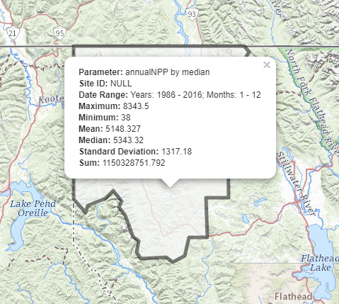
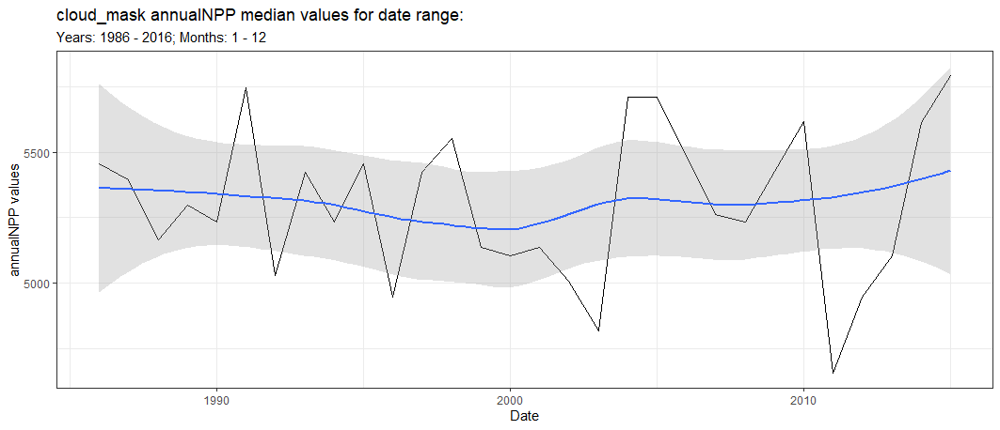

<!-- README.md is generated from README.Rmd. Please edit that file -->

```{r, include = FALSE}
knitr::opts_chunk$set(
  collapse = TRUE,
  comment = "#>",
  fig.path = "man/figures/README-",
  out.width = "100%"
)
```

# exploreRGEE

<!-- badges: start -->
<!-- badges: end -->

The goal of exploreRGEE is to explore Google Earth Engine (GEE) in the Rstudio IDE. This package uses bindings and functions from [rgee](https://github.com/r-spatial/rgee) and other spatial packages ([sf](https://github.com/r-spatial/sf), [leaflet](https://github.com/rstudio/leaflet)) to explore Google Earth Engine collections relatively quickly while using R. This package is meant to be exploratory and experimental but also provides the user quick functions to reproducible tasks, e.g. repetitive workflows. The reason for doing this in 
R is that some people are not familiar with JavaScript or Python but versed in R and this provides easy access to use GEE with commonly used methods  for exploratory data analysis ([tidyverse](https://github.com/tidyverse/tidyverse)). 

## Installation

Development version from [GitHub](https://github.com/) with:

``` r
# install.packages("devtools")
devtools::install_github("joshualerickson/exploreRGEE")

# recommended
# https://github.com/mikejohnson51/AOI/tree/master/R
remotes::install_github("mikejohnson51/AOI")
```

## Important Note

The backbone of this package relies on [rgee](https://github.com/r-spatial/rgee) and a GEE account (it's free), so for more information go to the rgee [website](https://github.com/r-spatial/rgee) or the GEE 
[website](https://developers.google.com/earth-engine/) for more details on how to get set-up and also tons of functionality using the [rgee](https://github.com/r-spatial/rgee) package!

## Similar Packages
Here is a list of similar packages that I've come across. Please let me know of any more!

[rgee](https://github.com/r-spatial/rgee)  

[eemont](https://github.com/davemlz/eemont)  

[earthEngineGrabR](https://jesjehle.github.io/earthEngineGrabR/)  

[geemap](https://github.com/giswqs/geemap)

## Flow

The main flow of exploreRGEE is to **get** GEE data and then either vizualize (`viz()`), reduce regions (`rr()`) or look at time series (`band()`). For example,

```{r, eval=F}

get_*() %>% viz()
get_*() %>% rr()
get_*() %>% band()

```

## Development

Contributions are welcome!

## Example

This is a basic example which shows you how to solve a common problem: visualizing net annual NPP data and creating a time series. 

```{r example, message=FALSE, error=FALSE, warning=FALSE}
library(exploreRGEE)
library(rgee)
library(AOI)

#this initializes the API
ee_Initialize()

```

Let's look at Northwestern Montana and the median NPP over a 30 year span (1986 to 2016). To do this, we'll call the `get_npp()`. This `gets` the collection while doing some pre-processing steps, e.g. date range, cloud masking, etc. You could also just use the `get_any()` function and provide the appropriate arguments.

```{r, eval=T}

lincoln_county <- AOI::aoi_get(state = "Montana", county = "Lincoln")

npp <- get_npp(lincoln_county, method = 'ld_NPP', param = 'annualNPP', stat = 'median', startDate = '1986-01-01', endDate = '2016-01-01')
```
<br>

Now we can vizualize this Image with `viz()`. The scale argument in this function is a way to get a *close* guess at a min/max argument. If you already have an idea of a min/max value (e.g. Normalized Difference: 0-1) then just put that into the arguments and `viz()` will not run `getInfo()`. This approach makes visualising much faster.

```{r}

npp %>% viz(scale = 250)

```


```{r, echo=FALSE, fig.align='center', out.width='50%'}
knitr::include_graphics("man/figures/npp.png")
```

<br>
Ok, now that we've got an idea of the area let's see what it would look like if we reduced this area of interest. To do that we'll use the `rr()` function. This function uses any GEE Feature Collection or sf object to reduce regions to common statistics, e.g. mean, max, min, median, stdDev and sum. **Scale** matters in this situation! So, make sure you understand what the underlying scale is. Sometimes I'll use a big scale just to see a coarse depiction and then when I go to the analyis I'll reduce that scale, up the `tileScale` and run `lazy = TRUE`.

```{r, eval = FALSE}
npp %>% rr(scale = 250, leaflet = TRUE)
```
```{r, echo=FALSE, fig.align='center', out.width='50%'}

```
<br>
Maybe we want to see how this region looked over time and not as static statistics? Well, we can use the `band()` function to do this. This function takes each year and `toBands()` the ImageCollection. From there, using rgee `ee_extract()` we can then convert to table values. This is an expensive function and you can use `lazy = TRUE`. This will split the object into 10 groups and run a for loop in the background in sequential. Future developments will hopefully make this parallel. 

```{r, eval = FALSE}

npp %>% band(scale = 1000, ggplot = TRUE)
```
<br>
```{r, echo=FALSE}

```


