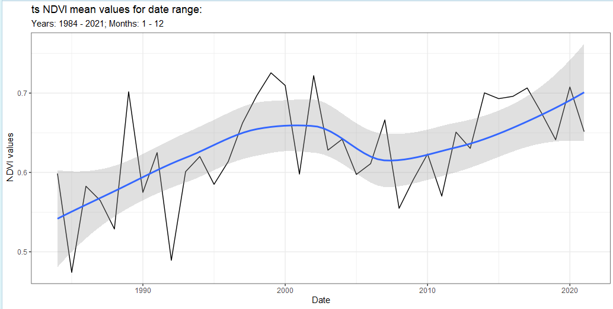
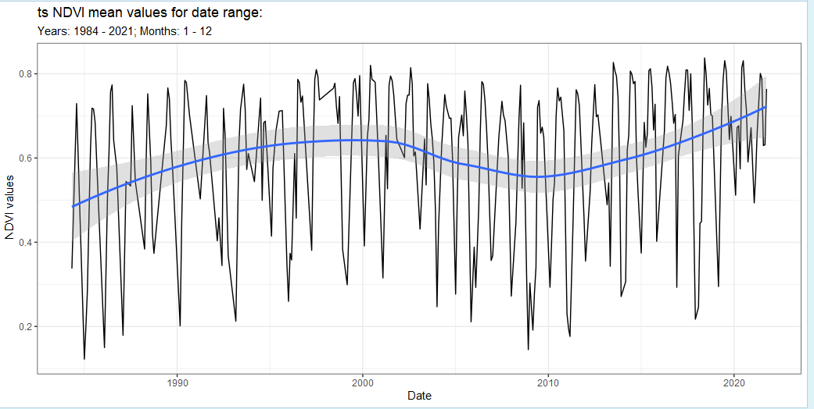
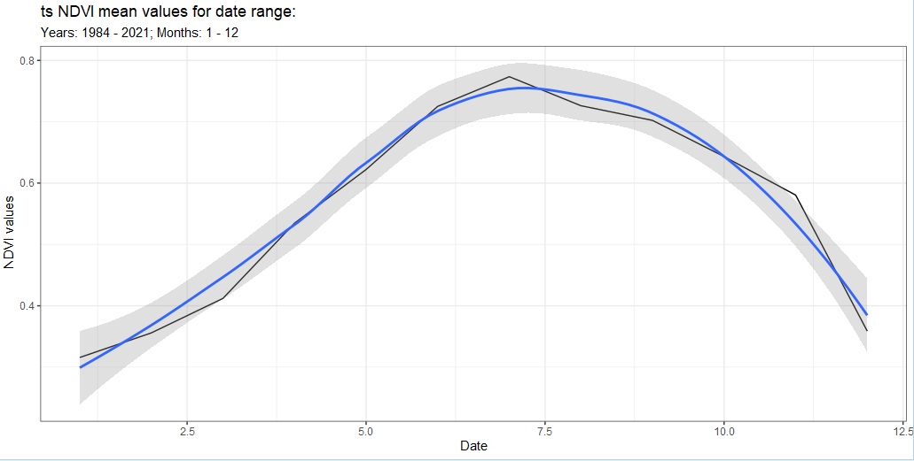
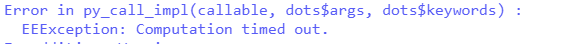
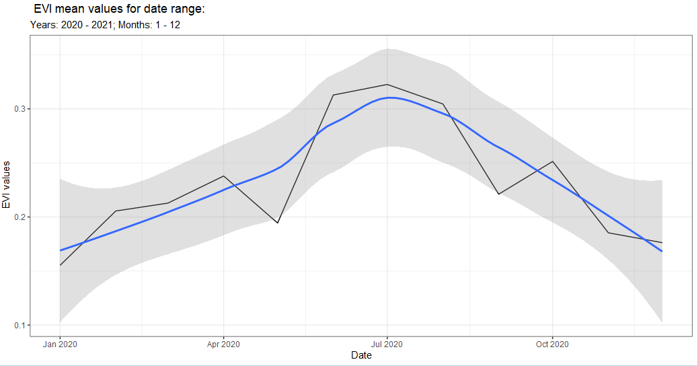
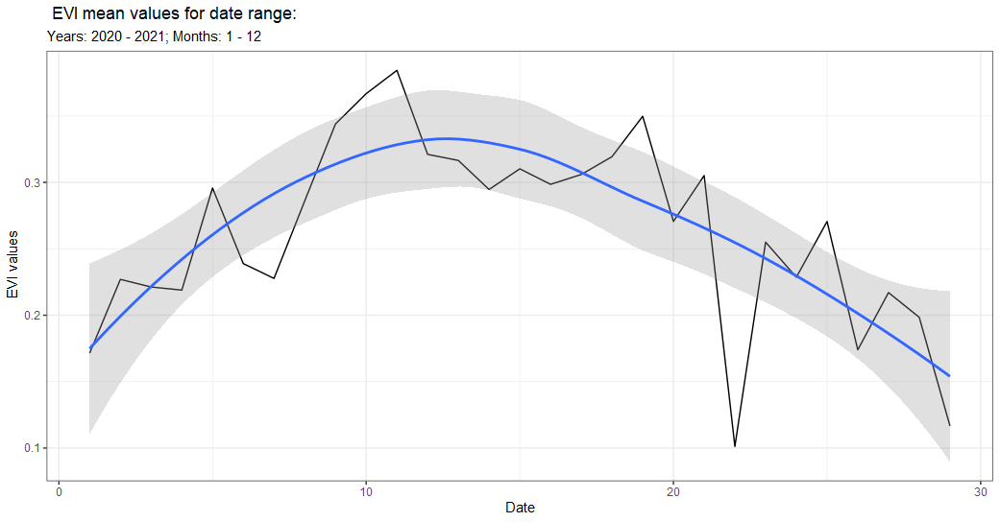
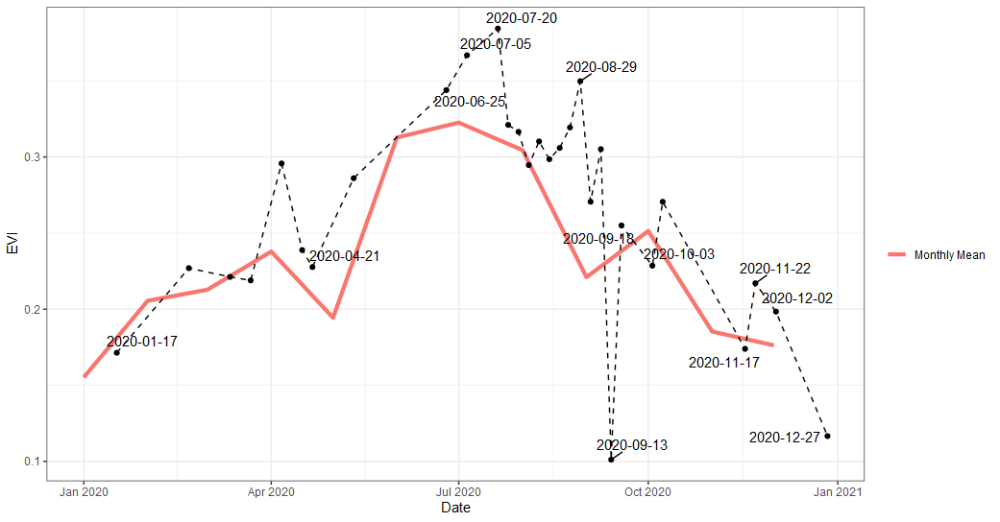

## Intro

The `band()` function is a way to get time series from an imageCollection by using the Earth Engine function [`toBands()`](https://developers.google.com/earth-engine/apidocs/ee-imagecollection-tobands) and [{rgee}](https://r-spatial.github.io/rgee/) `ee_extract()`. In short, it allows the user to reduce by time (temporal). To use the `band()` we'll need to provide a ImageCollection and from there we can get a time series. This is similar to `rr()` except we can now bring in the time component with the `temporal` argument. We'll go over a few examples below. Of note, this can be an expensive function depending on the size of query so take that into account when using and try using `lazy = TRUE` if expensive.   

## Use get  

First we'll need to get an image that we'll want to reduce on. We'll use the `get_landsat()` function, which will let us get an imageCollection. We'll need to define a `geometry` aka area of interest (aoi) so that we can clip the imageCollection. To do this we'll use the {mapedit}.  

```{r, eval=F}
library(mapedit)
aoi <- drawFeatures()
```

From here we can start with the `get_landsat()` function and get an ImageCollection. What's nice about using the `get_*()` functions is you will provide the time frame you are looking to analyze but if you don't use the `get*()` no worries! Just enter them into the arguments of the `band()` function as you'll see later. Another advantage of using the `get_landsat()` function is it will combine all the missions with `method = 'ts'` or harmonized `method = 'harm_ts'`. 

```{r, eval=F}
library(exploreRGEE)
library(rgee)

ee_Initialize()

landsat <- get_landsat(aoi = aoi,
                     method = 'ts',
                     startDate = '1984-01-01',
                     endDate = '2021-12-31',
                     cloud_mask = TRUE,
                     c.low = 1,
                     c.high = 12)

```


## Use band  

With `band()` we have a few options with our ImageCollection;  `'yearly' (default), 'monthly', 'year_month', 'all'`. `yearly` will filter the ImageCollection by year and then reduce by the `stat` argument. For example, if we wanted the yearly mean of some band we'd need to use `temporal = 'yearly'` and `stat = 'mean'` arguments in the `band()` call. Let's do that with our `landsat` object.  

```{r, eval=FALSE}

landsat_band <- landsat %>% band(scale = 30, 
                                 band = 'NDVI',
                                 temporal = 'yearly',
                                 stat = 'mean')
```

Now we have a data frame with yearly mean NDVI! We can also add some additional arguments for a quick look like `ggplot() = TRUE`. This will provide a side-effect plot of the time series but will also save the data frame.    

```{r, eval = FALSE}
landsat_band_yearly <- landsat %>% band(scale = 30, 
                                 band = 'NDVI',
                                 temporal = 'yearly',
                                 stat = 'mean',
                                 ggplot = TRUE)
```
<center>
**Band Yearly**
</center>
```{r, echo=FALSE, fig.align='center', out.width='50%'}

```
But we can do this for all the other time filtering as well.  

```{r, eval = FALSE}
landsat_band_year_month <- landsat %>% band(scale = 30, 
                                 band = 'NDVI',
                                 temporal = 'year_month',
                                 stat = 'mean',
                                 ggplot = TRUE)
```
<center>
**Band Year Month**
</center>
```{r, echo=FALSE, fig.align='center', out.width='50%'}

```
```{r, eval = FALSE}
landsat_band_monthly <- landsat %>% band(scale = 30, 
                                 band = 'NDVI',
                                 temporal = 'monthly',
                                 stat = 'mean',
                                 ggplot = TRUE)
```
<center>
**Band Monthly**
</center>
```{r, echo=FALSE, fig.align='center', out.width='50%'}

```


Now as you can imagine this can get out of hand pretty fast with numerous spatial features and long time spans. Below we'll go over using the argument `lazy = TRUE`.  

### Big call  

When we call something big (time and space) we'll most likely want to stash that away so we can do other processes in an R session but mostly we'll get this error below as well.  

```{r, echo=FALSE, fig.align='center', out.width='50%'}

```

We can stash it with `lazy = TRUE`, which will create a future task to be called later. That means after you run the function you'll need to use [{future}](https://github.com/HenrikBengtsson/future)  `some_name <- future::value()` to get your object back. This can take some time so be patient if it's a big call. Another thing that is going on with this call is that if the underlying spatial feature has more than 10 rows (points/polys) then the function will do a for-loop to try and avoid the error above. Most of the time this works but sometimes it might not depending on the query.  

## Using ImageCollection  

Again, just like the `viz()` and `rr()` functions you can always use your own derived ImageCollection; however, you'll need to specify your own years and months with the `startDate, endDate, c.low, c.high` arguments as well as provide a user geom (sf). Below we'll get an ImageCollection using [{eemont}](https://github.com/davemlz/eemont) package.  

```{r, eval=FALSE}
library(reticulate)
eemont <- import('eemont')

pt <- exploreRGEE:::sf_setup(aoi)

sent_sr <- ee$ImageCollection('COPERNICUS/S2_SR')$
    filterBounds(pt$geom)$
    filterDate('2020-01-01','2021-01-01')$
    maskClouds()$
    scaleAndOffset()$
    spectralIndices(c('EVI','NDVI'))

band_sent_sr <- band(sent_sr, 
                     temporal = 'year_month',
                     scale = 10, 
                     band = 'EVI',
                     stat = 'mean',
                     ggplot = TRUE,
                     user_geom = pt$aoi,
                     startDate = '2020-01-01',
                     endDate = '2021-01-01',
                     c.low = 1,
                     c.high = 12)
```

```{r, echo=FALSE, fig.align='center', out.width='50%'}

```

Or we can look at 'all' the values by changing `temporal = 'all'`.  

```{r eval = FALSE}
band_sent_sr_all <- band(sent_sr, 
                     temporal = 'all', #change to all
                     scale = 10, 
                     band = 'EVI',
                     stat = 'mean',
                     ggplot = TRUE,
                     user_geom = pt$aoi,
                     startDate = '2020-01-01',
                     endDate = '2021-01-01',
                     c.low = 1,
                     c.high = 12)
```

```{r, echo=FALSE, fig.align='center', out.width='50%'}

```

Or combine both our queries with `ggplot()`.  

```{r, eval = FALSE, echo = FALSE}
library(ggplot2)
ggplot() +
  geom_line(data = band_sent_sr, aes(Date, EVI, color = 'Monthly Mean'), size = 1.5) +
  geom_line(data = band_sent_sr_all %>% dplyr::mutate(Date = stringr::str_sub(raw_date, end = 9),Date = stringr::str_remove(Date, "X"),
                                   Date = lubridate::as_date(Date)), aes(Date, EVI), 
            col = 'black',
            linetype = 2) + 
  geom_point(data = band_sent_sr_all %>% dplyr::mutate(Date = stringr::str_sub(raw_date, end = 9),Date = stringr::str_remove(Date, "X"),
                                   Date = lubridate::as_date(Date)), aes(Date, EVI)) + theme_bw() + ggrepel::geom_text_repel(data = band_sent_sr_all %>% dplyr::mutate(Date = stringr::str_sub(raw_date, end = 9),Date = stringr::str_remove(Date, "X"), Date = lubridate::as_date(Date),
                                                                                                                                                                       Date2 = as.character(Date)), aes(Date, EVI, label = Date2), force = 30, max.overlaps = 1) + labs(color = '')

```

<center>
**Monthly Mean EVI and All QC'd EVI**
</center>

```{r, echo=FALSE, fig.align='center', out.width='50%'}

```


