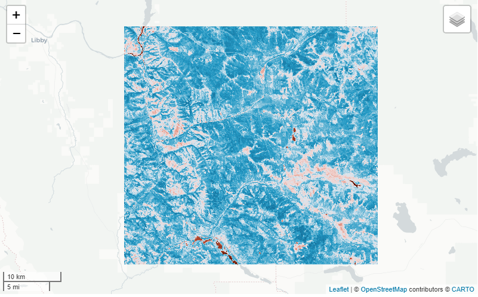
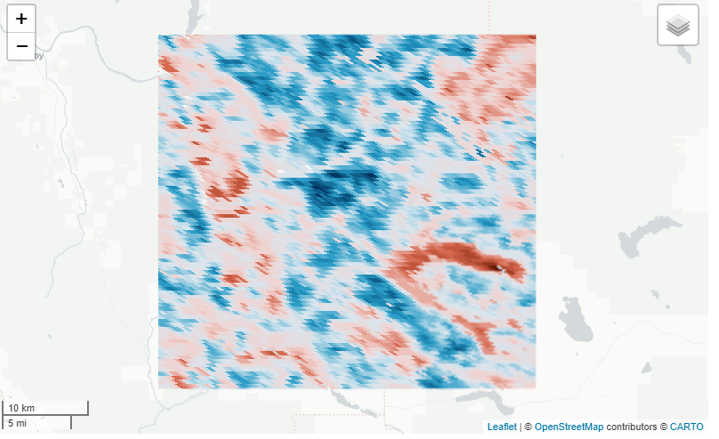
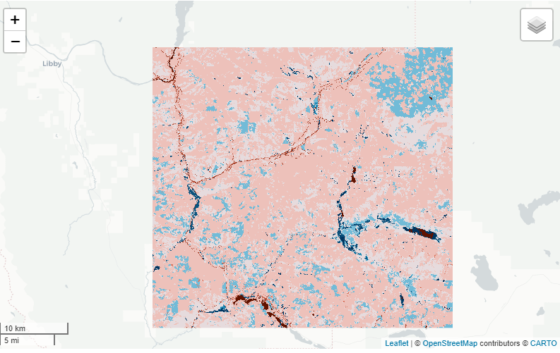

```{r, eval = T, message=F, warning=F, include=F}
library(rgee)
ee_Initialize()

library(exploreRGEE)
```
## Intro

We'll go through as much as we can with the `get_*()`'s in exploreRGEE. The main purpose of the get_()'s is to handle as much preprocessing as possible. One of the most frustrating things about getting an Image or ImageCollection outside earth engine (online) is remembering or having to navigate to get the ID, e.g. "LANDSAT/LC08/C01/T1_SR". The functions below will hopefully lessen that frustration so the user can easily get started in a workflow. Other reasons to use include filtering by bounds (location), date, month and mask, which are standard arguments in common workflows. 

## Using get

Below we'll go over a few `get_*()` functions; meteorological and landsat.

The main arguments are the method (what you want?), dates (what years do you want?), months (what months do you want?), stat (how do you want to reduce the pixel?) and mask (do you want to mask?); but, the one thing you do need is an area of interest or else the functions don't know where you want to do all these things! So, below is a basic example of getting monthly precipitation from PRISM from 2018 to 2020 while only including months April to October and reducing the pixel by the median.

```{r}
aoi <- exploreRGEE::huc
get_prism <- get_met(aoi = aoi,
                     method = 'AN81m',
                     startDate = '2018-01-01',
                     endDate = '2020-12-31',
                     stat = 'median',
                     c.low = 4,
                     c.high = 10)

```

Now all this does is 'prep' the area of interest for future functions like `viz()`, `rr()` and `band()`. That's not completely true though because if you look at the list it will contain an ImageCollection, Image, geom, etc. 

```{r}
get_prism
```

This is important because you might want to do other things with the Image or ImageCollection you just processed. For example, let's say we want to get landsat data real quick using the `get_landsat()` but also want to use [eemont](https://github.com/davemlz/eemont) processing steps. Then just call that ImageCollection from the list. **Important Note** - `cloud_mask = FALSE` to use with eemont. This provides you with a ImageCollection that's been filtered by geom (location) and date (years, months). 

```{r, eval=F}

library(reticulate)
eemont <- import('eemont')

get_ld8 <- get_landsat(aoi = aoi,
                     method = 'ld8',
                     startDate = '2018-01-01',
                     endDate = '2020-12-31',
                     stat = 'median',
                     cloud_mask = FALSE,
                     c.low = 6,
                     c.high = 10)

mont_ld8 <- get_ld8$imageCol$
                    maskClouds()$
                    scale()$
                    index('vegetation')$
                    median()

# to visualize provide an area of interest to 'user_shape'
mont_ld8 %>% viz(band = 'NDVI', min = 0, max = 1, user_shape = aoi)

```
```{r, echo=FALSE, fig.align='center', out.width='50%'}

```

In addition, you may want something else like a Moderate Resolution Imaging Spectroradiometer (MODIS) product. To use the functionality as seen in previous examples, just call the `get_any()`. This function allows the user to provide an earth engine collection snippet (`method = ...`) to get the same normal processing steps as above. Be aware of the Image or ImageCollection that you are calling! Just like in GEE online, you need to know what the appropriate arguments are...

```{r, eval=F}

modis_lai <- get_any(aoi, i_type = 'ImageCollection',
                     method = "MODIS/006/MCD15A3H",
                      startDate = '2010-01-01',
                     endDate = '2019-12-31',
                     c.low = 4,
                     c.high = 10,
                     stat = 'median')

modis_lai %>% viz(scale = 500, band = 'Lai')
```
```{r, echo=FALSE, fig.align='center', out.width='50%'}

```

**For an Image**

```{r, eval=F}
nlcd <- get_any(aoi, i_type = 'Image',
                method = 'USGS/NLCD/NLCD2011')

nlcd %>% viz(scale = 30, band = 'landcover')
```

```{r, echo=FALSE, fig.align='center', out.width='50%'}

```


