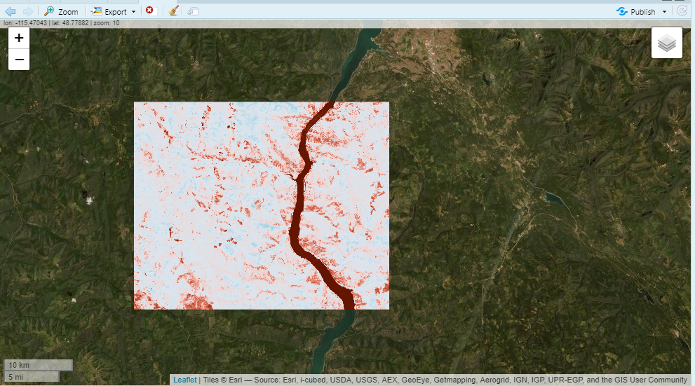
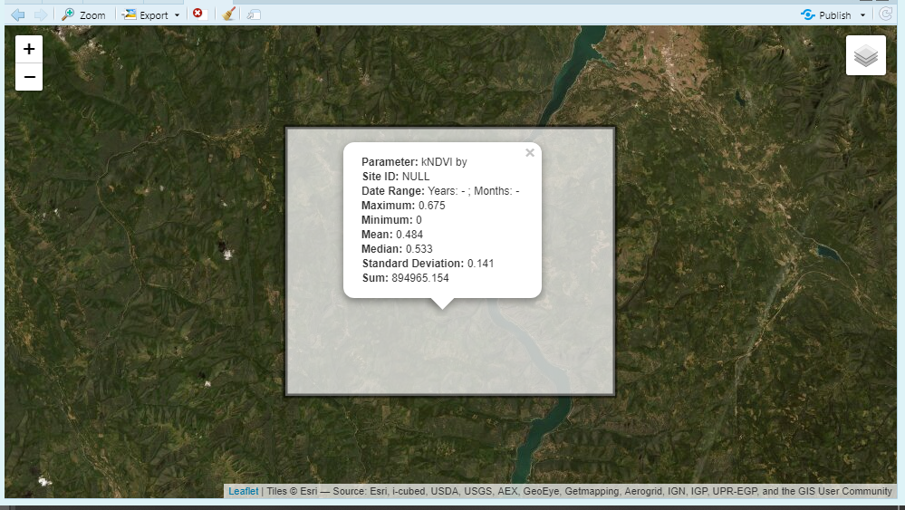
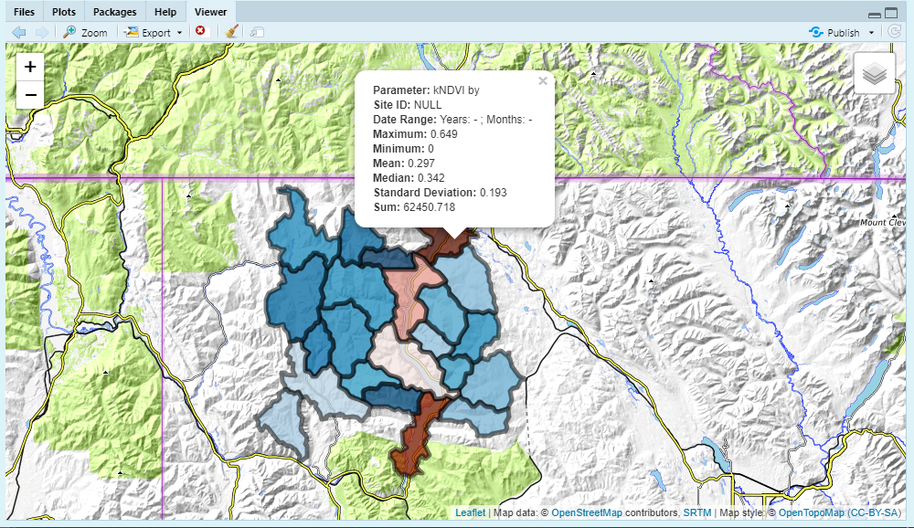
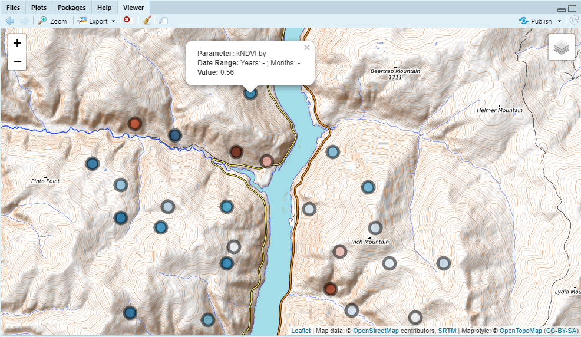

## Intro

Sometimes a user may want to reduce a image to a region (e.g. zonal statistics or point extraction) to gather some aggregated information. Earth Engine and rgee provide means to do this through the `reduceRegions()` function. In addition, rgee provides a function `ee_as_sf()` which let's us easily get that information in the R session! However, there are a few steps that are needed before you get to this point; 1.) a reduced image, 2.) a reducer stat, 3). a feature to reduce on (geometry). This article will go through these steps using the `rr()` function.  

## Use get  

First we'll need to get an image that we'll want to reduce on. We'll use the `get_landsat()` function, which will let us get an imageCollection as well as a final image. We'll need to define a `geometry` aka area of interest (aoi) so that we can clip the imageCollection. To do this we'll use the {mapedit}.  

```{r, eval=F}
library(mapedit)
aoi <- drawFeatures()
```

From here we can start with the `get_landsat()` function and get an image. Let's use it with the {eemont} python package as well. The [{eemont}](https://github.com/davemlz/eemont) is a really nice comprehensive python package that integrates a myriad of current, intuitive and user friendly earth engine processes. 

```{r, eval = FALSE}
library(exploreRGEE)
library(rgee)
ee_Initialize()

library(reticulate)
#py_install('eemont')
eemont <- import('eemont')

get_ld8 <- get_landsat(aoi = aoi,
                     method = 'ld8',
                     startDate = '2018-01-01',
                     endDate = '2021-12-31',
                     cloud_mask = FALSE,
                     c.low = 6,
                     c.high = 10)

mont_ld8 <- get_ld8$imageCol$
                    maskClouds()$
                    scale()$
                    spectralIndices('kNDVI')$
                    median()
# to visualize provide an area of interest to 'user_shape'
mont_ld8 %>% viz(band = 'kNDVI', min = 0, max = 1, user_shape = aoi)
```

<center>
**kNDVI**
</center>
```{r, echo=FALSE, fig.align='center', out.width='50%'}

```

## rr  

Now that we have a image we can start to reduce that image by several parameters in earth engine: 'max', 'mean', 'median', 'min', 'stdDev', 'sum'. The `rr()` function will reduce the region by these stats and return an sf object (aoi) with reduced regions.  


```{r, eval=F}
rr_knvi <- mont_ld8 %>% rr(scale = 30,
                           band = 'kNDVI',
                           user_shape = aoi)
```

We can also add the argument `leaflet = TRUE` to get a interactive map of the reduced region.  

```{r, eval=F}
rr_knvi <- mont_ld8 %>% rr(scale = 30, 
                           band = 'kNDVI',
                           user_shape = aoi,
                           leaflet = TRUE)
```

```{r, echo=FALSE, fig.align='center', out.width='50%'}

```


This is nice but what if we wanted to use different areas of interest? Well, you have a few options; bring in a new spatial feature and start over or use an earth engine feature collection within the aoi. Below we'll use the HUC12 feature collection in earth engine within our aoi.  

```{r, eval=F}
rr_knvi <- mont_ld8 %>% rr(scale = 30,
                           geeFC = 'USGS/WBD/2017/HUC12',
                           band = 'kNDVI',
                           user_shape = aoi,
                           leaflet = TRUE)
```

```{r, echo=FALSE, fig.align='center', out.width='50%'}

```

We can also just use point geometries.  

```{r, eval = F}
rr_knvi_pts <- mont_ld8 %>% rr(scale = 30,
                           band = 'kNDVI',
                           user_shape = points_sf,
                           leaflet = TRUE)
```

```{r, echo=FALSE, fig.align='center', out.width='50%'}

```
