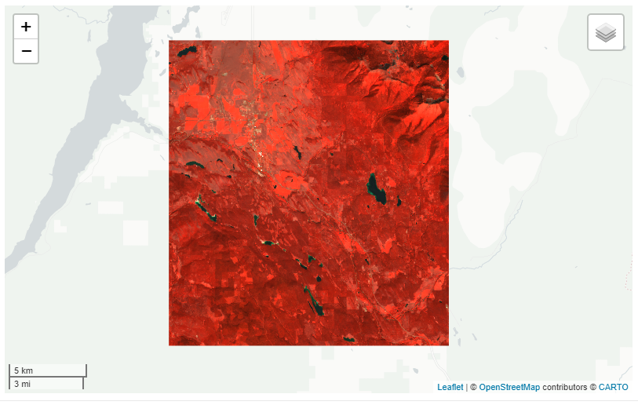
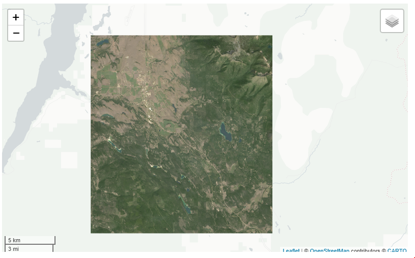
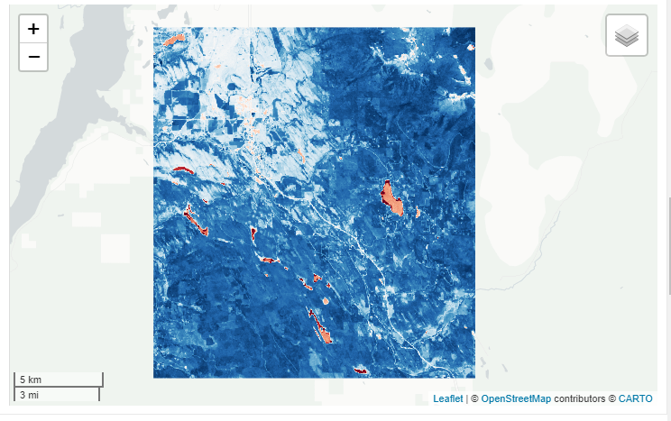
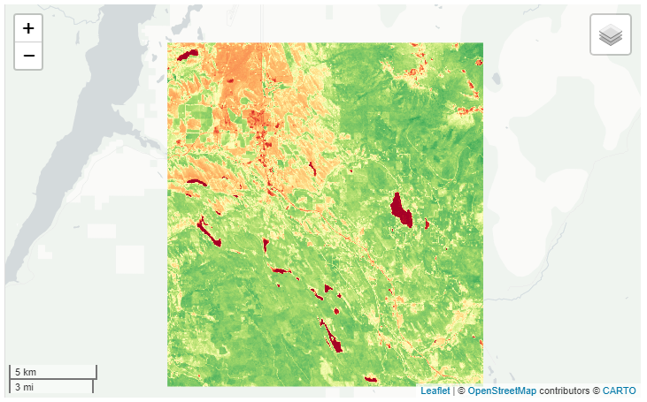
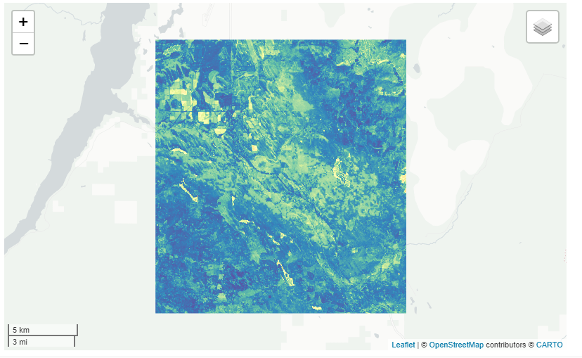
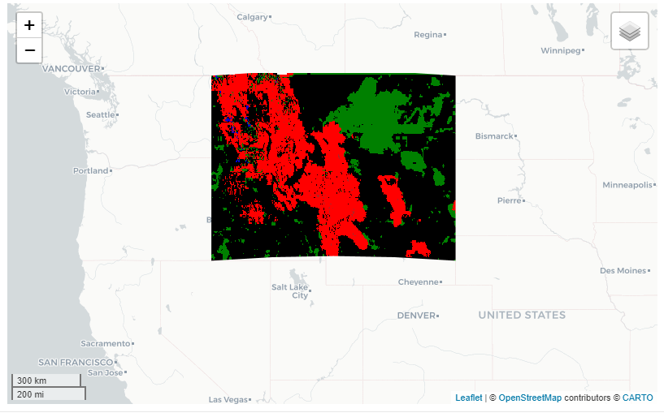
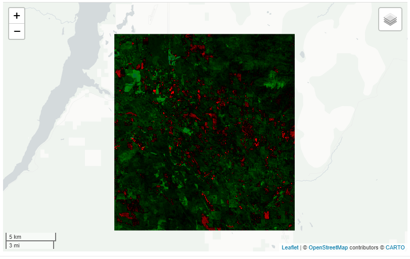
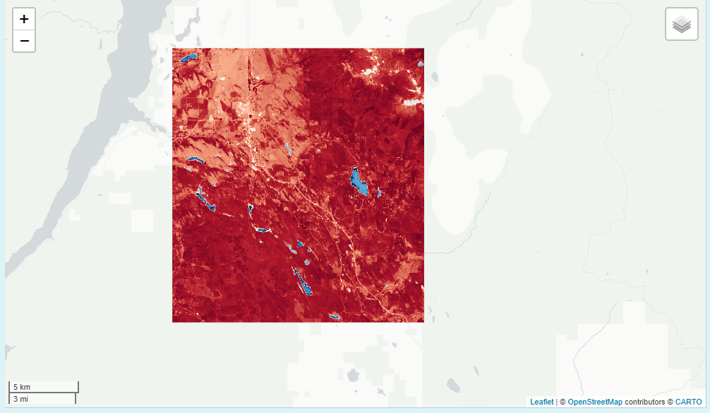

## Intro

This vignette will go over the different capabilities of the `viz()` function. The main purpose of `viz()` is to vizualize earth engine Images quickly. To do that, we need to either know the Image range prior (-1 to 1) or we need to calculate some quick stats (min and max) or my favorite, guess. The former is the fastest and works well for normalized indices (NDVI, NDWI) but when dealing with other Images it's not as clear cut. This leads to continuously using infamous getInfo() function from GEE on the side to find these parameters when exploring. However, the `viz()` function will run getInfo() in the background for you if `min` and `max` are not provided. In addition, the process to get the info can take a long time depending on the scale; thus, the scale is set high (250 meters) but it may make sense to make it even larger for faster processing or when dealing with coarser pixels, e.g. PRISM is 800m. The reason for this is that earth engine defaults to a 0 to 255 scale when no min or max value is given. Thus, `viz()` will help us do that quickly as shown in the examples below.

## Vizualizing

Let's say we wanted to vizualize some remote sensing bands so that we can possibly extract some more meaningful variables in a ML model, i.e. say predicting stream occurrence. To do that, earth engine does the heavy lifting by providing remote sensing images (and [rgee](https://github.com/r-spatial/rgee)) but we still need to be able to explore in a relatively quick manner. That's where the `get_*()` along with `viz()` come into play. 

```{r, warning=FALSE, message=F}
library(exploreRGEE)
library(AOI)
library(rgee)
ee_Initialize()

huc <- exploreRGEE::huc
ld8 <- get_landsat(huc, method = 'ld8', stat = 'mean',
                   startDate = '2014-01-01', endDate = '2019-12-31',
                   c.low = 7, c.high = 10)
```

After processing the data we can now vizualize in a leaflet map.

```{r, error=TRUE}

ld8 %>% viz()

```

If you get this error it's because you didn't specify the band you want to use for vizualizing. You can either put a character (see below), numeric (band = 1) or c('NIR', 'Green', 'Blue'). In addition, you can also call it in the `param` argument when you start but I'd recommend keeping all the bands. One reason to keep all bands is if you want to look at RGB or false-color composite or switch between bands quickly in the `rr()` and `band()` functions.

**False Color**

```{r, eval=FALSE}
ld8 %>% viz(min = 0, max = 3000, band = c('NIR', 'Green', 'Blue'))
```
```{r, echo=FALSE, fig.align='center', out.width='50%'}

```
**True Color**
-play with gamma to lighten up image.
```{r, eval=FALSE}
ld8 %>% viz(min = 0, max = 3000, band = c('Red', 'Green', 'Blue'), gamma = 2)
```
```{r, echo=FALSE, fig.align='center', out.width='50%'}

```
**NDVI**
```{r, eval=F}
ld8 %>% viz(band = 'NDVI')
```

```{r, echo=FALSE, fig.align='center', out.width='50%'}

```

**Change Palette**
```{r, eval=F}

# palettes use hcl.pals()

ld8 %>% viz(band = "NDVI", min = 0, max = 1, 
            palette = 'RdYlGn')
```
```{r, echo=FALSE, fig.align='center', out.width='50%'}

```

Now let's say we want to look at the standard deviation. We'll just grab the landsat image from above and change the `stat` argument. An important note is that if you use `stdDev` you have to explicitly call the `param` argument in the `get_*()`. Here, we changed the palette and reversed the order of that palette.

```{r,eval=F}
ld8 <- get_landsat(huc, method = 'ld8', stat = 'stdDev',
                   param = 'NDVI',
                   startDate = '2014-01-01', endDate = '2019-12-31',
                   c.low = 7, c.high = 10)
```

```{r,eval=F}
ld8 %>% viz(scale = 30, palette = 'Spectral', reverse = TRUE) 
```
```{r, echo=FALSE, fig.align='center', out.width='50%'}

```


We can also use `viz()` to help us vizualize differences in images. Let's look at the states Montana and Idaho and see what the difference from 2000-2009 to 2010-2019 would be for precipitation using GRIDMET. When using the `get_diff()` with `viz()` we will get some color intervals for the difference calculations. Black meaning near zero, red (negative), green/blue (positive). 

```{r, eval = FALSE}

aoi <- AOI::aoi_get(state = c('Montana', 'Idaho'))
prism <- get_met(aoi, method = 'GRIDMET', startDate = '2000-01-01', endDate = '2009-12-31', param = 'pr')

get_diff(prism, startDate2 = '2010-01-01', endDate2 = '2019-12-31') %>% viz()

```
```{r, echo=FALSE, fig.align='center', out.width='50%'}

```

Or if we want to look at the difference of landsat **NDVI** for the same time period you can do that as well. 
```{r, eval=F}
ld_ts <- get_landsat(huc, method = 'ts', stat = 'mean',
                    startDate = '2000-01-01', endDate = '2009-12-31',
                   c.low = 7, c.high = 10)

get_diff(ld_ts, startDate2 = '2010-01-01', endDate2 = '2019-12-31',band = "NDVI" ) %>% viz()
```
```{r, echo=FALSE, fig.align='center', out.width='50%'}

```

Finally, you can always use a class 'ee.image.Image' with `viz()`. For example, let's use the [eemont](https://github.com/davemlz/eemont) processing steps and then vizualize.

```{r, eval = F}
library(reticulate)
eemont <- import('eemont')

aoi <- exploreRGEE:::setup(huc)

ld8 <- ee$ImageCollection("LANDSAT/LC08/C01/T1_SR")$filterBounds(aoi)
ld8 <- ld8$maskClouds()$scale()$index(c('GNDVI','NDWI','BAI','NDSI'))$median()

ld8 %>% viz(user_shape = huc, band = 'NDWI')
```

**NDWI**
```{r, echo=FALSE, fig.align='center', out.width='50%'}

```


